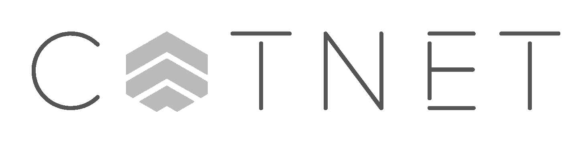
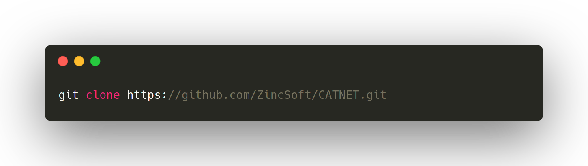
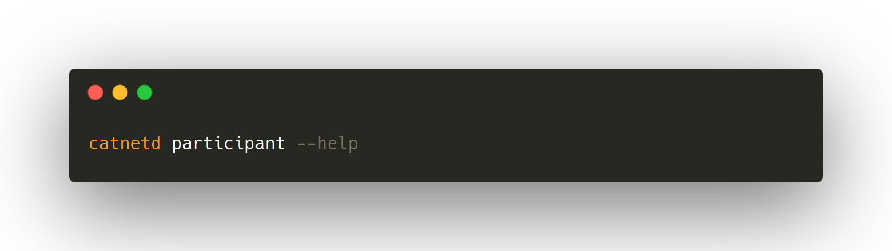
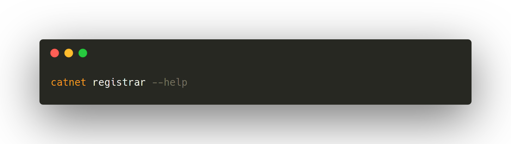

# CATnet
<p align="center">
  <a href="github.com/ZincSoft/CATNET" target="blank"></a>
    
    
    
    
    
    
    
	
    
    
</p>
CATnet is a more desentralized web for a more modern age.

## User use
### Cloning
Either download a .tar.gz/.zip from the green *download* button above, or clone via git:

```bash
git clone https://github.com/ZincSoft/CATNET.git
```
### Building
```bash
cargo install --path .
# or
cargo install catnet
```

### Use
#### Participant
Look at the help menu, then run with the flags/arguments you want!

```bash
catnetd participant --help
```

#### Registrar
Look at the help menu, then run with the flags/arguments you want!

```bash
catnetd registrar --help
```


## Software Development
### Usefull flags
During development of CATnet, you may wish these flags:
* `-l0`,           enables all levels of logging. Please note that *trace* and *info* logging are disabled in release builds.

### Git Workflow
Pretend the other people working on this code base are insane, have a shotgun, and know where you live. As such, please follow `WORKFLOW.MD`.

### Specification/White paper
[Here](https://docs.google.com/document/d/1t3FXJTDr-h4J9iPvzBLDdCKGJAukKruhrJjNaMWRgq0/edit?ts=5fc41d5f#heading=h.3bqhl2hpdgyy) is a link to our specifications document.

### Contributing
[]()
[]()
[]()
[](https://github.com/zincsoft/catnet/issues)  
[]()
[](http://makeapullrequest.com)  
Thank you for even considering contributing to this project. At this time, we will *NOT* be merging pull requests that are linked to issues that themselves are linked to a certain project. We are, however, eternally greatfull for bug fixes.

